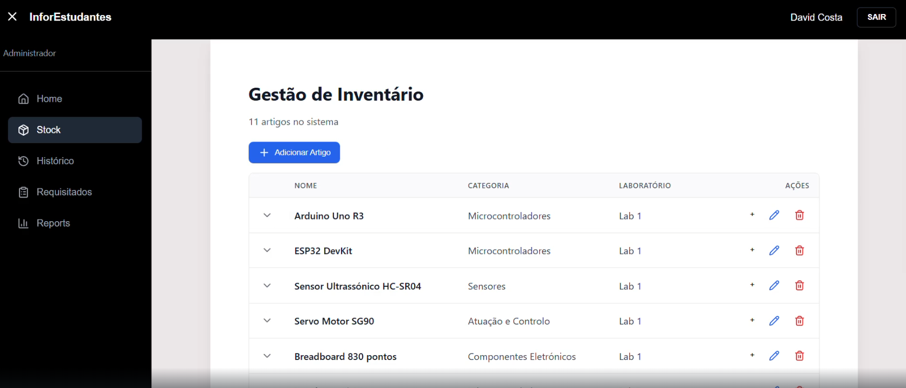
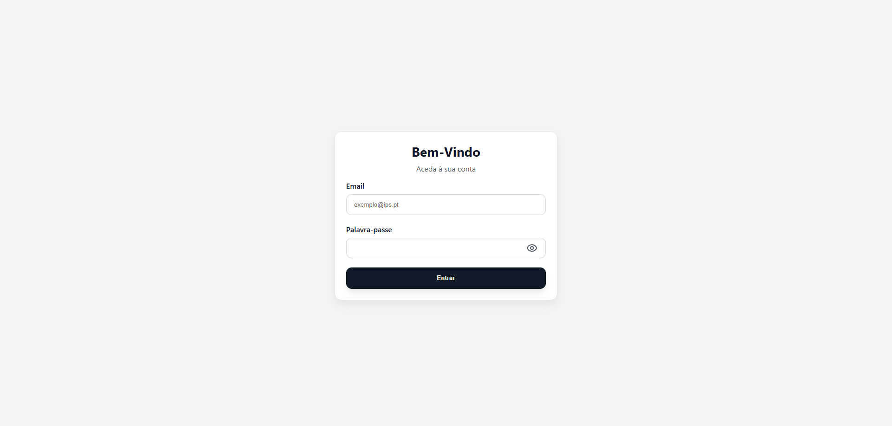
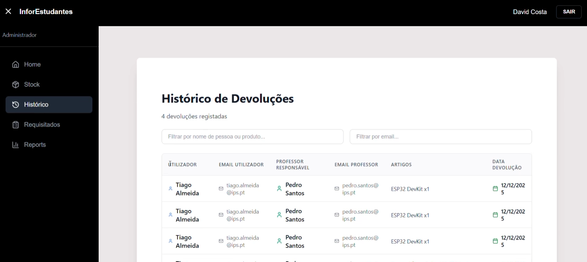

# Stock Management System



A complete laboratory inventory management system with web interface and RFID support. Handles inventory management, item tracking, reservations, and reporting across multiple laboratories.

## Screenshots

### Login



### Dashboard


### History



## Features

-   **RESTful API**: Clean, resource-based endpoints
-   **Modern Frontend**: React-based responsive web interface
-   **JWT Authentication**: Secure token-based authentication
-   **RFID Support**: RC522 reader integration for item tagging
-   **Multi-role System**: Admin, Manager, and User roles
-   **Reservation System**: Request and track item loans
-   **Reporting**: Inventory reports and loan history
-   **Docker Support**: Containerized backend and frontend

## Tech Stack

**Backend:**

-   **PHP**: 7.4+
-   **Database**: MySQL/MariaDB
-   **Authentication**: JWT (JSON Web Tokens)
-   **Dependencies**: Firebase JWT, PHPMailer, Dotenv

**Frontend:**

-   **React**: 18+
-   **Vite**: Build tool
-   **Tailwind CSS**: Styling
-   **Node.js**: Runtime environment

**Hardware:**

-   **Arduino**: RC522 RFID Reader

## Prerequisites

-   PHP 7.4 or higher
-   Node.js 16+ and npm
-   MySQL 5.7 or MariaDB 10.2+
-   Composer
-   Docker and Docker Compose (optional)
-   Optional: Arduino with RC522 RFID reader

## Installation

### Option 1: Using Docker (Recommended)

```bash
docker-compose up -d
```

This will:

-   Start MySQL database
-   Start PHP backend on `http://localhost:8000`
-   Start React frontend on `http://localhost:5173`
-   Import database schema

### Option 2: Manual Setup

#### Backend Setup

1. Navigate to backend directory:

```bash
cd backend
```

2. Install PHP dependencies:

```bash
composer install
```

3. Create environment file:

```bash
cp .env.example .env
```

4. Configure database and other settings in `.env`:

```env
DB_HOST=localhost
DB_USER=root
DB_PASS=your_password
DB_NAME=stock_management

JWT_SECRET=your_secret_key_here

MAIL_HOST=smtp.example.com
MAIL_PORT=587
MAIL_USER=your_email@example.com
MAIL_PASS=your_password
MAIL_FROM=noreply@example.com

CORS_ORIGINS=http://localhost:5173,http://localhost:3000
```

5. Create database and import schema:

```bash
mysql -u root -p < ../database_structure.sql
mysql -u root -p < ../create_cartao_rfid_table.sql
```

6. Start the PHP development server:

```bash
php -S localhost:8000
```

The API will be available at `http://localhost:8000/api`

#### Frontend Setup

1. Navigate to frontend directory:

```bash
cd frontend
```

2. Install Node dependencies:

```bash
npm install
```

3. Create environment file:

```bash
cp .env.example .env
```

4. Configure API URL in `.env`:

```env
VITE_API_URL=http://localhost:8000
```

5. Start the development server:

```bash
npm run dev
```

The frontend will be available at `http://localhost:5173`

## Project Structure

```
stock-manager/
├── backend/                  # PHP REST API
│   ├── api/                  # API endpoints
│   │   ├── artigo.php        # Article CRUD operations
│   │   ├── auth.php          # Authentication endpoints
│   │   ├── categorias.php    # Category management
│   │   ├── subcategorias.php # Subcategory management
│   │   ├── labs.php          # Laboratory management
│   │   ├── reservas.php      # Reservation/request handling
│   │   ├── historico_devolucoes.php # Return history
│   │   ├── professores.php   # Professor management
│   │   ├── rfid.php          # RFID operations
│   │   ├── nfc_cards.php     # NFC card management
│   │   ├── reports.php       # Report generation
│   │   ├── read_rfid.php     # RFID reading endpoint
│   │   └── db.php            # Database operations
│   ├── models/               # Data models
│   │   ├── Artigo.php        # Article model
│   │   ├── CartaoRFID.php    # RFID card model
│   │   ├── Categoria.php     # Category model
│   │   ├── Subcategoria.php  # Subcategory model
│   │   ├── Lab.php           # Laboratory model
│   │   ├── Reserva.php       # Reservation model
│   │   ├── Reports.php       # Reports model
│   │   └── Users.php         # User model
│   ├── config/               # Configuration
│   │   ├── database.php      # Database connection
│   │   ├── jwt.php           # JWT configuration
│   │   ├── cors.php          # CORS headers
│   │   ├── email.php         # Email configuration
│   │   └── helpers.php       # Helper functions
│   ├── controllers/          # Controllers
│   │   └── auth.php          # Authentication logic
│   ├── includes/             # Middleware
│   │   └── jwt_middleware.php # JWT verification middleware
│   ├── arduino/              # Hardware code
│   │   └── rc522_reader.ino  # RFID reader sketch
│   ├── Dockerfile.backend    # Docker configuration
│   ├── composer.json         # PHP dependencies
│   ├── index.php             # Entry point
│   └── README.md             # Backend documentation
├── frontend/                 # React Web Application
│   ├── src/
│   │   ├── components/       # React components
│   │   │   ├── Navbar.jsx    # Navigation bar
│   │   │   ├── Sidebar.jsx   # Admin sidebar
│   │   │   ├── cart.jsx      # Shopping cart
│   │   │   ├── pedidos.jsx   # User orders
│   │   │   ├── meusPedidos.jsx # My orders
│   │   │   ├── reportsges.jsx # Reports (admin)
│   │   │   ├── tableges.jsx  # Admin data table
│   │   │   ├── tableuser.jsx # User data table
│   │   │   ├── stockform.jsx # Stock form
│   │   │   ├── login-form.jsx # Login form
│   │   │   ├── historicoDevolucoes.jsx # Return history
│   │   │   └── footer.jsx    # Footer
│   │   ├── styles/           # CSS stylesheets
│   │   ├── utils/            # Utility functions
│   │   │   └── apiUrl.js     # API configuration
│   │   ├── App.jsx           # Main app component
│   │   └── main.jsx          # Entry point
│   ├── public/               # Static assets
│   ├── Dockerfile.frontend   # Docker configuration
│   ├── package.json          # Dependencies
│   ├── vite.config.js        # Vite configuration
│   ├── tailwind.config.js    # Tailwind CSS config
│   ├── postcss.config.js     # PostCSS config
│   └── README.md             # Frontend documentation
├── docker-compose.yml        # Docker Compose configuration
├── database_structure.sql    # Database schema
├── database_setup.sql        # Setup script
├── create_cartao_rfid_table.sql # RFID table creation
├── schema_correct.sql        # Schema corrections
├── composer.json             # Root PHP config
├── package.json              # Root Node config
└── README.md                 # This file
```

## Usage

### User Roles

The system has three user roles:

-   **Admin**: Full access to all features, user management, and reports
-   **Manager**: Can manage inventory, create and review reports
-   **User**: Can view inventory, make reservations, and view their order history

### Frontend Features

1. **Login**: Authenticate with email and password
2. **Browse Inventory**: Search and filter articles by category and laboratory
3. **Make Reservations**: Request items for loan
4. **Track Orders**: View status of your reservations
5. **Return History**: See all returned items
6. **Admin Dashboard**: Manage inventory, users, and view reports (admin only)

### API Usage

All API requests require JWT authentication in the Authorization header:

```
Authorization: Bearer <your_jwt_token>
```

## API Endpoints

### Authentication

-   `POST /api/auth.php` - User login
    -   Request: `{"email": "user@example.com", "password": "password"}`
    -   Response: `{"token": "jwt_token", "user": {...}}`

### Articles

-   `GET /api/artigo.php` - List all articles
-   `GET /api/artigo.php?id=1` - Get specific article
-   `GET /api/artigo.php?lab=1` - Filter by laboratory
-   `GET /api/artigo.php?categoria=1` - Filter by category
-   `GET /api/artigo.php?pesquisa=term` - Search articles
-   `POST /api/artigo.php` - Create article
-   `PUT /api/artigo.php` - Update article
-   `DELETE /api/artigo.php?id=1` - Delete article

### Categories

-   `GET /api/categorias.php` - List all categories
-   `GET /api/categorias.php?id=1` - Get specific category
-   `POST /api/categorias.php` - Create category
-   `PUT /api/categorias.php` - Update category
-   `DELETE /api/categorias.php?id=1` - Delete category

### Laboratories

-   `GET /api/labs.php` - List all laboratories
-   `POST /api/labs.php` - Create laboratory
-   `PUT /api/labs.php` - Update laboratory
-   `DELETE /api/labs.php?id=1` - Delete laboratory

### Reservations/Requests

-   `GET /api/reservas.php` - List reservations
-   `POST /api/reservas.php` - Create reservation
-   `PUT /api/reservas.php` - Update reservation status
-   `DELETE /api/reservas.php?id=1` - Cancel reservation

### RFID Operations

-   `GET /api/rfid.php` - Get all RFID cards
-   `POST /api/rfid.php` - Register new RFID card
-   `POST /api/nfc_cards.php` - Associate card with article
-   `GET /api/read_rfid.php` - Read RFID card data

### Reports

-   `GET /api/reports.php` - Generate reports
-   `GET /api/historico_devolucoes.php` - Return history

## Authentication

The API uses JWT tokens for authentication:

1. User logs in via `POST /api/auth.php`
2. Backend returns JWT token
3. Client includes token in Authorization header:
    ```
    Authorization: Bearer <token>
    ```
4. Server validates token with JWT middleware

Token expiration and secret are configured in `.env`:

```
JWT_SECRET=your_secret_key
```

## Database Schema

Key tables:

-   **usuarios** - User accounts and authentication
-   **artigos** - Inventory articles/items
-   **categorias** - Article categories
-   **subcategorias** - Article subcategories
-   **laboratorios** - Laboratory spaces
-   **cartao_nfc** - RFID/NFC card tracking
-   **reservas** - Article requests and reservations
-   **historico_devolucoes** - Loan and return history

## Models

### Artigo

```php
$artigo = new Artigo();
$artigo->nome_artigo = 'Item Name';
$artigo->num_serial = 'SN123456';
$artigo->id_subcat = 1;
$id = $artigo->criar();
```

### CartaoRFID

```php
$rfid = new CartaoRFID();
$uid = $rfid->registrar('UID_string');
$rfid->associarComArtigo('uid', 1);
```

### Reserva

```php
$reserva = new Reserva();
$reserva->criar($id_usuario, $id_artigo);
```

## RFID Integration

### RC522 Arduino Setup

1. Upload `arduino/rc522_reader.ino` to Arduino
2. Connect RC522 reader:

    - MISO to pin 12
    - MOSI to pin 11
    - CLK to pin 13
    - SDA to pin 10
    - RST to pin 9
    - GND and 3.3V

3. Arduino reads RFID UID and sends via serial
4. Python/Node bridge script forwards to API endpoint

### Reading RFID Cards

```bash
curl http://localhost:8000/api/read_rfid.php
```

Response:

```json
{
    "uid": "A1B2C3D4",
    "status": "active",
    "associated_article": 5
}
```

## Error Handling

The API returns standard HTTP status codes:

-   `200` - Success
-   `201` - Created
-   `400` - Bad Request
-   `401` - Unauthorized
-   `403` - Forbidden
-   `404` - Not Found
-   `500` - Server Error

Error responses include a message:

```json
{
    "message": "Error description",
    "error": "Detailed error information"
}
```

## Configuration

### CORS

Configure allowed origins in `config/cors.php` or `.env`:

```
CORS_ORIGINS=http://localhost:5173,http://localhost:3000
```

### Database Connection

Database configuration in `config/database.php` uses PDO:

```php
$dsn = "mysql:host={$host};dbname={$db}";
$pdo = new PDO($dsn, $user, $pass);
```

### JWT

JWT configuration in `config/jwt.php`:

```php
$secret = $_ENV['JWT_SECRET'];
$algorithm = 'HS256';
```

## Security

-   **JWT Tokens**: Secure token-based authentication
-   **CORS Headers**: Whitelist allowed origins
-   **Password Hashing**: bcrypt hashing for passwords
-   **Input Validation**: PDO parameterized queries to prevent SQL injection
-   **Error Handling**: Hide sensitive error details in production

## Development

### Enable Debug Mode

Set in `.env`:

```
DEBUG=true
```

### Testing Endpoints

```bash
curl -X GET http://localhost:8000/api/artigo.php

curl -X POST http://localhost:8000/api/auth.php \
  -H "Content-Type: application/json" \
  -d '{"email":"user@example.com","password":"password"}'
```

### Database Queries

Direct database access available through PDO connection.

## Deployment

### Docker Deployment

1. Build and start containers:

```bash
docker-compose up --build
```

2. Access the application:
    - Frontend: `http://localhost:5173`
    - Backend API: `http://localhost:8000/api`

### Production Deployment

**Backend:**

1. Set environment variables in `.env`:

    ```
    DEBUG=false
    DB_HOST=your-database-host
    JWT_SECRET=strong-secret-key
    CORS_ORIGINS=https://your-frontend-domain.com
    ```

2. Configure web server (Apache/Nginx) to point to `backend/` directory

3. Enable HTTPS on both frontend and backend

**Frontend:**

1. Build the React app:

    ```bash
    npm run build
    ```

2. Deploy the `dist/` folder to your hosting service (Netlify, Vercel, etc.)

3. Configure API URL to point to production backend

## Troubleshooting

### Database Connection Error

-   Check DB_HOST, DB_USER, DB_PASS in .env
-   Ensure MySQL service is running
-   Verify database exists

### JWT Authentication Failed

-   Check JWT_SECRET is set in .env
-   Verify token is valid and not expired
-   Check Authorization header format

### CORS Errors

-   Add frontend URL to CORS_ORIGINS in .env
-   Verify backend is responding to OPTIONS requests
-   Check browser console for exact error

### RFID Connection Issues

-   Check Arduino serial connection
-   Verify RC522 reader wiring
-   Test Arduino sketch with Serial Monitor

## Support & Documentation

-   [Backend Documentation](backend/README.md)
-   [Frontend Documentation](frontend/README.md)
-   Database Schema: [database_structure.sql](database_structure.sql)
-   Arduino RFID Reader: [rc522_reader.ino](backend/arduino/rc522_reader.ino)
